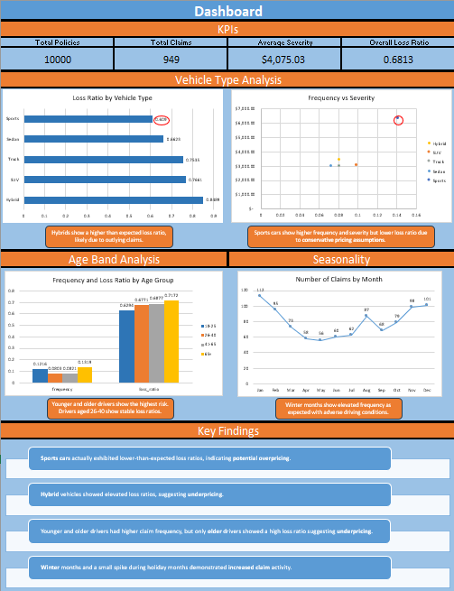

# Personal auto insurance portfolio analysis

Simulated and analyzed a 10,000-policy personal auto insurance portfolio to evaluate pricing adequacy, risk segmentation, and profitability. Built end-to-end: data generation in Python, analysis in PostgreSQL, and visualization in Excel.

---

## Tools
| Layer | Tool |
|-------|------|
| Data generation | Python (Pandas, NumPy) |
| Data analysis | PostgreSQL |
| Visualization | Excel |

---

## Part 1 — Data generation (Python)

Generated two tables simulating a realistic personal auto book of business.

**Policies** (`policy_id`, `state`, `driver_age`, `vehicle_type`, `claim_probability`, `annual_premium`)  
Claim probability and annual premium are risk-rated using driver age and vehicle type. See `generate_data.ipynb` for the full rating algorithm.

**Claims** (`claim_id`, `claim_date`, `policy_id`, `claim_amount`, `peril_type`)  
Claim occurrence modeled via Bernoulli draw using each policy's `claim_probability`. Claim severity drawn from a lognormal distribution, with sports cars parameterized for higher expected severity. Seasonal variation incorporated into claim date assignment.

**Sanity checks (realized values)**
| Metric | Value |
|--------|-------|
| Observed claim frequency | 9.49% |
| Average severity | $4,075 |
| Overall loss ratio | 68.1% |
| Average annual premium | $567.62 |

---

## Part 2 — Data analysis (PostgreSQL)

Portfolio-level metrics plus segmented analysis answering five core underwriting questions:

- Do sports cars produce more claims overall?
- Which vehicle type has the highest severity?
- Do different age groups have different claim frequencies?
- What time of year is most dangerous?
- Does premium properly reflect risk by segment?

Four aggregate tables exported to `Dashboard.xlsx`.

---

## Part 3 — Actuarial dashboard (Excel)

Visualizations addressing three profitability questions:

- Is the portfolio profitable overall?
- Which segments (vehicle type, age band) carry the most risk?
- Are there seasonal trends in claim activity?

Charts include loss ratio by vehicle type, frequency by age band, and monthly claim volume.

---

## Key findings

**Pricing adequacy issues identified:**
- Sports vehicles exhibited *lower*-than-expected loss ratios due to conservative pricing assumptions → potential overpricing
- Hybrid vehicles showed *elevated* loss ratios → potential underpricing

**Risk segmentation:**
- Younger (<25) and older (65+) drivers had the highest claim frequencies, consistent with actuarial convention
- Winter months showed a measurable increase in claim activity

---

## Potential extensions
- Incorporate state-level geographic rating factors
- Segment analysis by `peril_type` (collision, comprehensive, liability)
